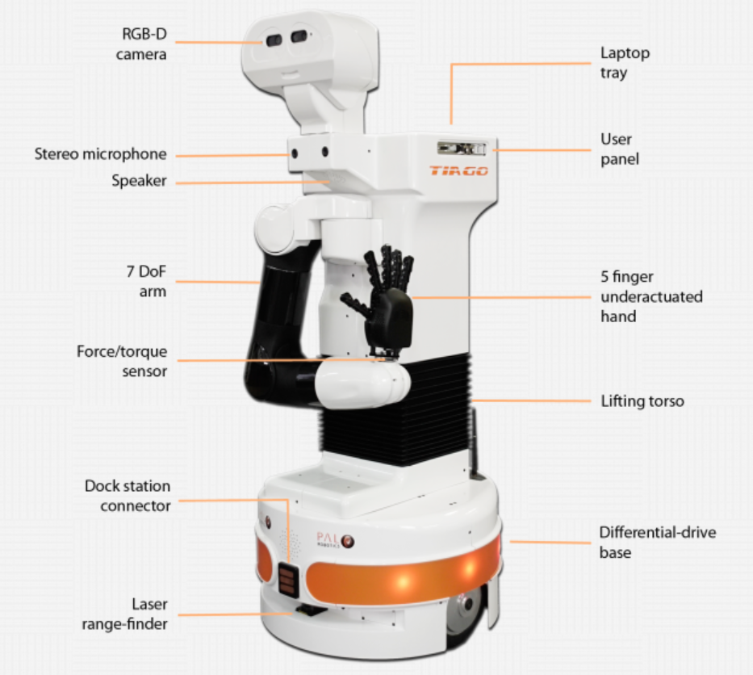
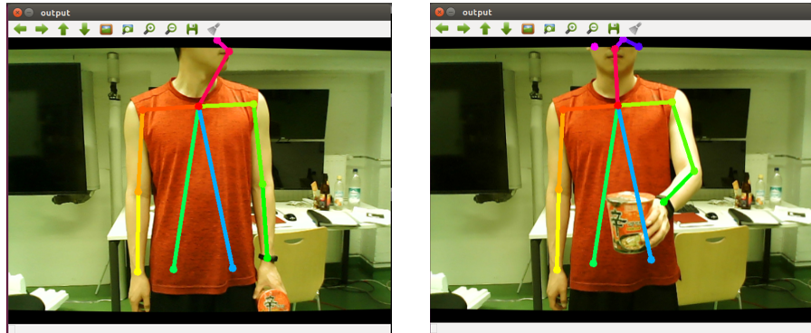
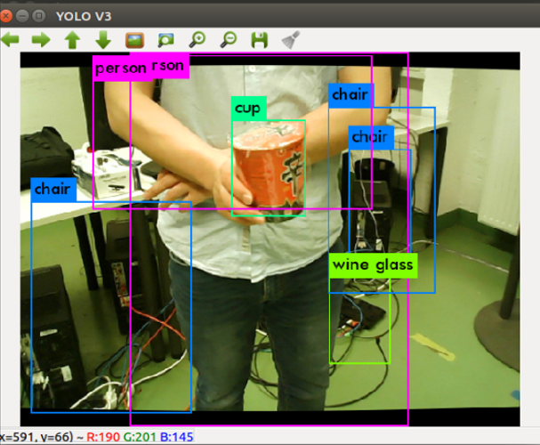
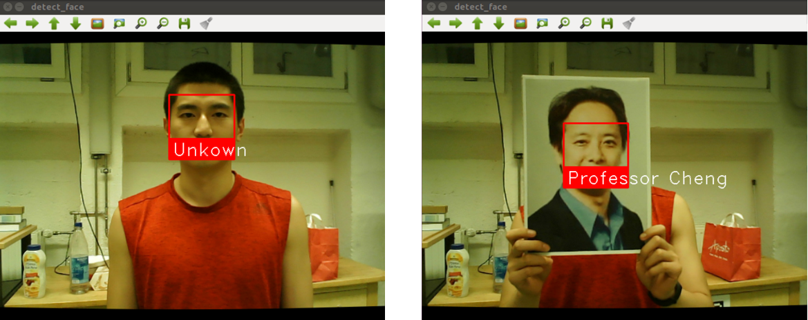

# Pick-and-Deliver-Objects-to-the-Professor

In this project, we work with the TIAGo robot to execute a service task: When a person is offering TIAGo a cup, he is able to react to it and grasp the cup. Then he looks around, searches for the Professor and delivers the cup.

    
     

## Group Member and Task Split

| Group Member |                        Task                         |
| :----------: | :-------------------------------------------------: |
|   Ji Chen    | System Integration, Speech Recognition, Navigation  |
|  Weiqi Luo   | Gesture Detection, Face Detection, Object Detection |
|  Chao Dong   |                    Manipulation                     |

## TIAGo Serving Robot

    
     
    TIAGo serving robot

## An Overview of Perception Part

### 1. Gesture Detection based on OpenPose

[OpenPose](https://github.com/CMU-Perceptual-Computing-Lab/openpose) is the state-of-the-art pose estimation algorithm, which enables a real-time multi-person key-point detection for body, face, and hands estimation.

In the project, the gesture detection is aimed to detect the gesture of offering something, which triggers the start of the Pick-and-Deliver-Objects task.

    
     

### 2. Object Detection based on YOLO

[You only look once (YOLO)](https://pjreddie.com/darknet/yolo/)  is a real-time object detection system. On a Pascal Titan X it processes images at 30 FPS and has a mAP of 57.9% on COCO test-dev.

The bounding boxes obtained with YOLO helps to specify the position of the object, hence TIAGo is able to reach his hand to grasp the target object.

    
     

### 3. Face Detection based on Python Library Face Recognition 

[Face Recognition](https://github.com/ageitgey/face_recognition) is a Python Library which is built using [dlib](http://dlib.net/)'s face recognition built with deep learning. The model has an accuracy of 99.38% on the [Labeled Faces in the Wild](http://vis-www.cs.umass.edu/lfw/) benchmark.

With face detection TIAGo is able to distinguish professor from other unknown person and deliver the cup. 

    
     

